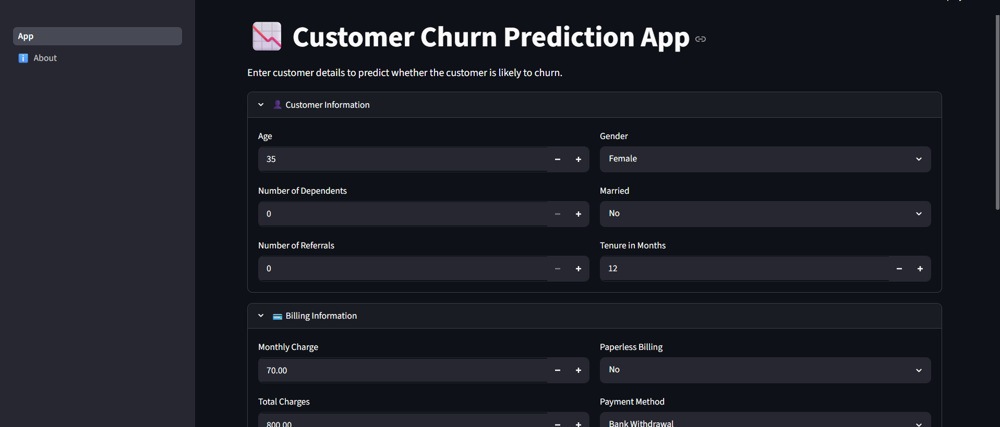
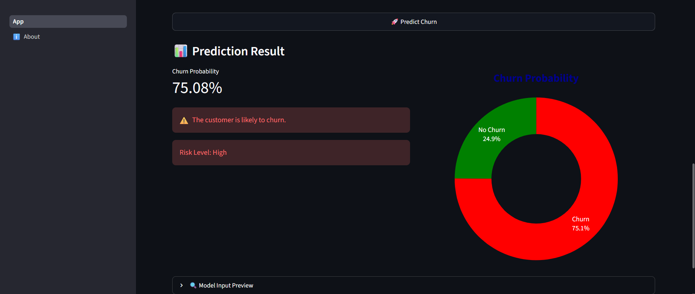
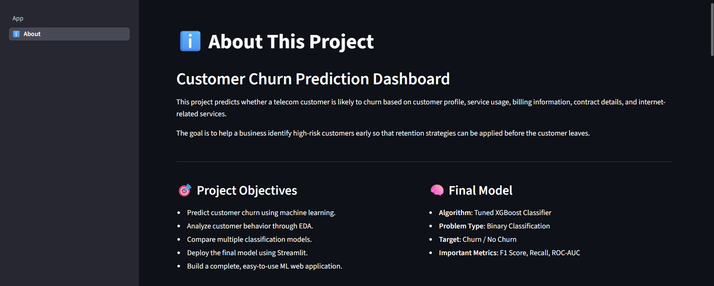

# 📉 Customer Churn Prediction

A Machine Learning web application built with **Streamlit** that predicts whether a telecom customer is likely to churn based on customer billing information, and subscribed services.

The project uses a trained **Tuned XGBoost Classifier** and provides both the churn prediction and the probability of churn through an interactive dashboard.

---

## 🚀 Features

- Predicts whether a customer is likely to churn.
- Displays churn probability and risk level.
- Interactive and user-friendly Streamlit interface.
- Customer information grouped into organized sections.
- Pie chart visualization of churn probability.
- Includes project information in the About page.

---

## 🛠️ Technologies Used

- Python
- Streamlit
- Pandas
- Scikit-learn
- Plotly
- Joblib

---

## 📂 Project Structure

```text
Customer_Churn_Prediction/
│
├── app.py
├── Telecom_Customer_Churn.csv
├── churn_project_model.pkl
├── feature_columns.pkl
├── requirements.txt
├── README.md
│
└── pages/
    └── 1_ℹ️_About.py
```

---

## 📊 Dataset

This project uses the **Maven Analytics Telecom Customer Churn Dataset**.

The dataset contains **7,043 customer records** and includes demographic information, subscription details, internet services, billing information, and customer churn status. Before training, the data was cleaned, preprocessed, and categorical features were encoded using one-hot encoding.

---

## 🤖 Machine Learning Model

Model Used:

- "Tuned XGBoost Classifier"

The model was trained after:

- Data Cleaning
- Feature Engineering
- One-Hot Encoding
- Feature Selection
- Hyperparameter Tuning using GridSearchCV

---

## 📋 Input Features

The model considers features such as:

- Age
- Number of Dependents
- Number of Referrals
- Tenure in Months
- Monthly Charge
- Total Charges
- Average Monthly GB Download
- Security Services
- Gender
- Marital Status
- Contract Type
- Internet Type
- Streaming Services
- Multiple Lines
- Paperless Billing
- Payment Method
- Promotional Offer

---

## 📈 Output

The application provides:

- Customer Churn Prediction
- Churn Probability
- Risk Level
- Probability Visualization

---

## ▶️ How to Run

Clone the repository

```bash
git clone https://github.com/yourusername/Customer_Churn_Prediction.git
```

Install dependencies

```bash
pip install -r requirements.txt
```

Run the application

```bash
streamlit run App.py
```

---

## 📷 Application Preview

## Screenshots

### Home Page


### Prediction Result


### About Page


---

## 📌 Future Improvements

- SHAP-based prediction explanations
- Personalized retention recommendations
- Model comparison dashboard
- Real-time prediction using APIs

---

## 👨‍💻 Author

**Dushyant Silot**

Electronics and Communication Engineering (Dual Degree)

National Institute of Technology Hamirpur

📧 Email: dushyant3864@gmail.com

---
